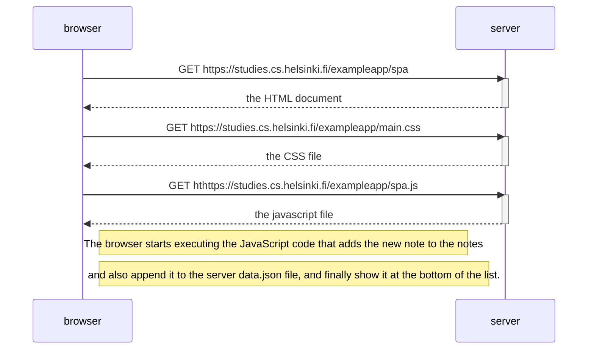

```mermaid
sequenceDiagram
    participant browser
    participant server

    browser->>server: GET https://studies.cs.helsinki.fi/exampleapp/spa
    activate server
    server-->>browser: the HTML document
    deactivate server

    browser->>server: GET https://studies.cs.helsinki.fi/exampleapp/main.css    
    activate server
    server-->>browser: the CSS file
    deactivate server

    browser->>server: GET hthttps://studies.cs.helsinki.fi/exampleapp/spa.js    
    activate server
    server-->>browser: the javascript file
    deactivate server

    Note right of browser: The browser starts executing the JavaScript code that adds the new note to the notes 
    Note right of browser: and also append it to the server data.json file, and finally show it at the bottom of the list.

```